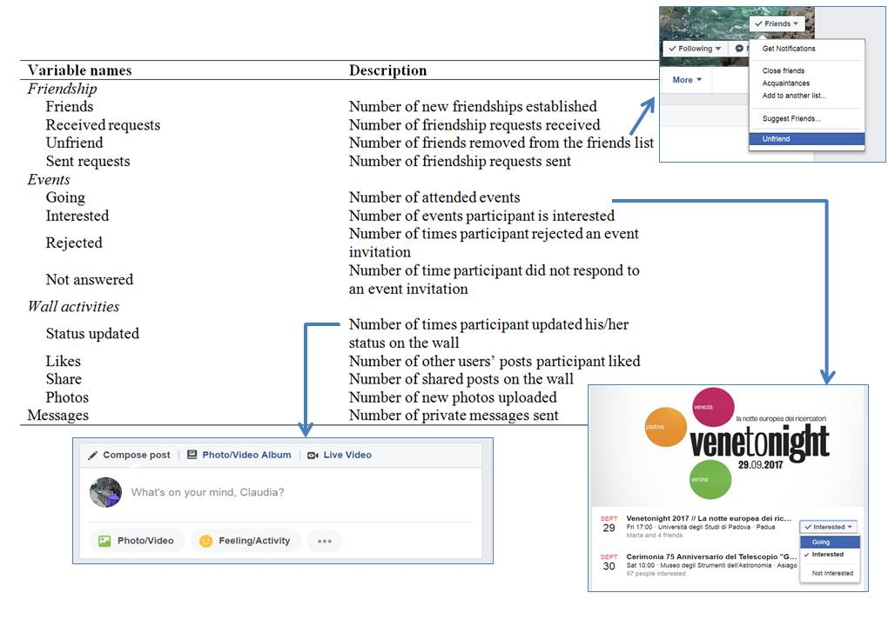

myFBr
================
Livio Finos and the others
11 febbraio 2019

Welcome to the myFBr
====================

myFBr is a R library specifically developed to extract information from Facebook profiles. This library contains codes able to read information from the html pages, to transform such information into quantitative data, and to save data in a dataset. As an example, the image below shows the data about *friends* which can be extracted.

------------------------------------------------------------------------

Set up
------

To **install** this github version type (in R):

    #if devtools is not installed yet: 
    # install.packages("devtools") 
    library(devtools)
    install_github("livioivil/myFBr")

------------------------------------------------------------------------

Some examples
-------------

``` r
library(myFBr)
path=system.file("extdata","example",package = "myFBr")
t(getInfo(path))
```

    ##              [,1]                      
    ## nome         "matescienze.summerschool"
    ## email        "livio.finos@unipd.it"    
    ## dataReg      "2014-08-27 23:56:00"     
    ## dataDownload "2017-10-14 17:20:00"     
    ## sesso        "F"                       
    ## dataNascita  "1976-09-01"              
    ## cittaNatale  "San Pellegrino Terme"    
    ## situazSentim "NULL"

How to download your FB profile as a zip file
---------------------------------------------

myFBr uses a copy of Facebook data downloaded from your Facebook profile (see Figure 1). Use the function 'download a copy of your Facebook data' in the settings section of your Facebook profile (full instructions for downloading data from Facebook accounts are presented in the following official Facebook link: <https://www.facebook.com/help/131112897028467/> ; see Figure 1). You will have to download a zip folder containing several html pages. They included friendship activities, events, wall activities, text messages, photos, ect.


They included friendship activities, events, wall activities, and text messages. A full description of the variables is provided here 
